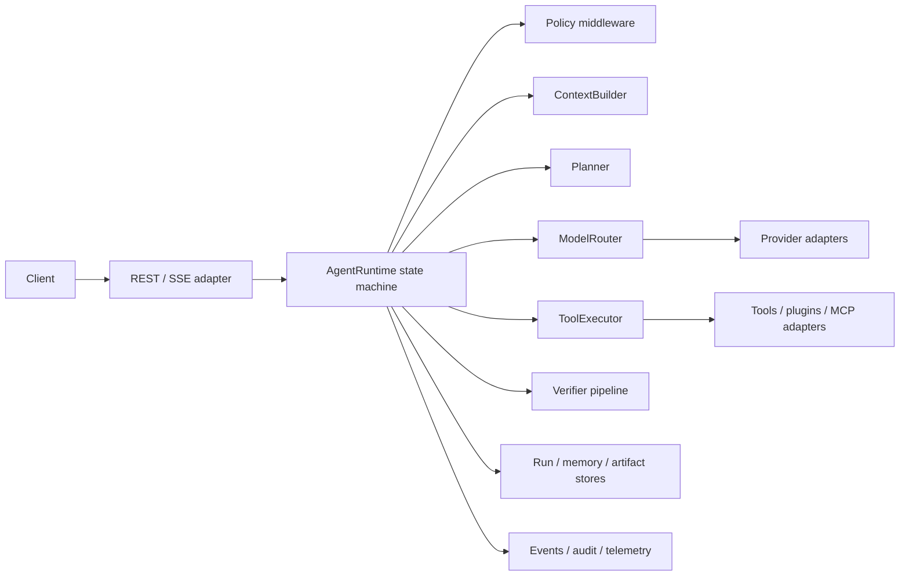

# Agent Core

Agent Core is a provider-neutral Python 3.12 runtime for configuration-driven agents. It exposes the same typed agent contract as a library and a FastAPI service, with deterministic state transitions, tool approvals, model fallback, streaming events, resumability, tenant isolation, and offline tests.

## Architecture



The domain layer contains immutable Pydantic contracts and protocols. Orchestration depends only on those protocols. The composition root resolves configured adapters and registries; provider SDK or wire details never enter the runtime.


No hidden reasoning is persisted. `ExecutionSummary` records concise decisions, call counts, retries, usage, versions, and trace identifiers. Reproduction requires the versioned agent definition, normalized request, persisted checkpoint, referenced prompt/config versions, and deterministic provider/tool fixtures.

## Quick start

```bash
python -m venv .venv
. .venv/bin/activate
pip install -e '.[dev]'
pytest
AGENT_CORE_CONFIG=examples/minimal_agent/agent.yaml agent-core
```

Requests require identity headers so tenant isolation cannot be accidentally omitted:

```bash
curl -X POST http://localhost:8000/v1/runs \
  -H 'content-type: application/json' \
  -H 'x-tenant-id: demo' -H 'x-user-id: user-1' \
  -d '{"agent":"minimal","input":"Hello"}'
```

See [architecture](docs/architecture.md), [operations](docs/operations.md), [provider extension](docs/providers.md), [compatibility](docs/provider-compatibility.md), and [threat model](docs/threat-model.md).

