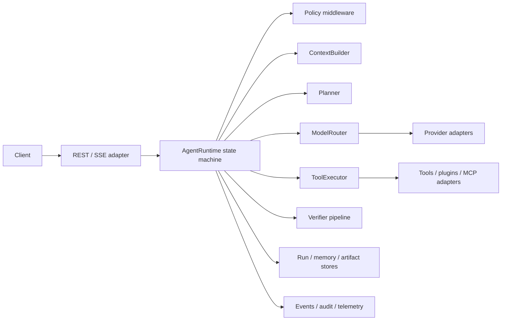
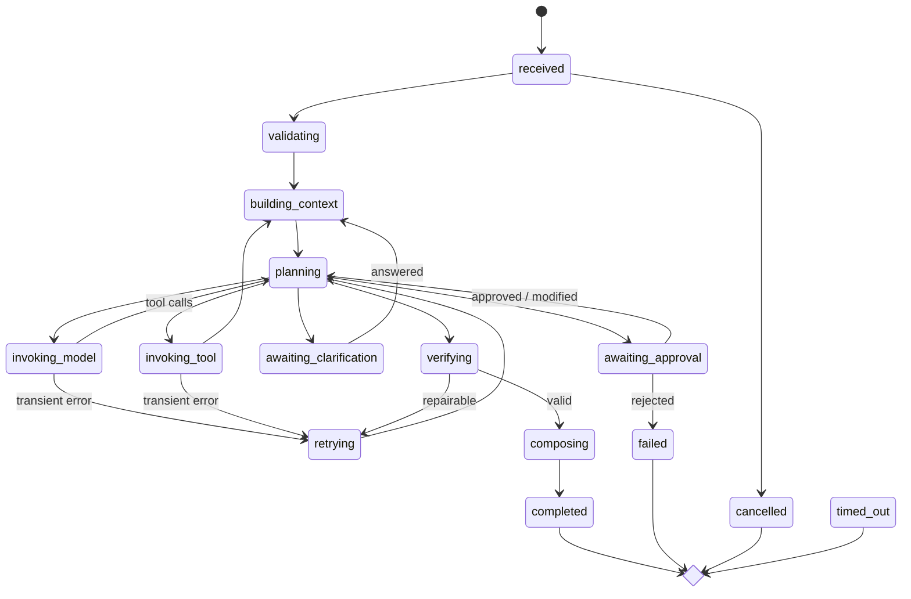

# Traccia Runtime

Traccia Runtime is a provider-neutral Python 3.12 runtime for configuration-driven agents. It exposes the same typed agent contract as a library and a FastAPI service, with deterministic state transitions, tool approvals, model fallback, streaming events, resumability, tenant isolation, and offline tests.

Operational caching is provider-neutral and opt-in. Bounded in-memory and Redis adapters support
global, tenant, user, session, and run isolation; runtime integrations cover model capabilities,
retrieval, exact model responses, and safe idempotent tool results. Cache operations are traced through
OpenTelemetry and therefore appear in Traccia when its exporter is enabled.

Governed analytical agents can use a typed, checkpointed DAG with separate result handles, a
production semantic compiler, versioned analytical methods, non-LLM forecast/simulation/causal/
optimization services, source-trust and query-governance controls, deterministic evaluation gates,
and PostgreSQL-leased distributed work. These remain generic Runtime services; applications own all
domain metrics, formulas, thresholds, and model implementations.

## Architecture



The domain layer contains immutable Pydantic contracts and protocols. Orchestration depends only on those protocols. The composition root resolves configured adapters and registries; provider SDK or wire details never enter the runtime.



No hidden reasoning is persisted. `ExecutionSummary` records concise decisions, call counts, retries, usage, versions, and trace identifiers. Reproduction requires the versioned agent definition, normalized request, persisted checkpoint, referenced prompt/config versions, and deterministic provider/tool fixtures.

## Quick start

```bash
python -m venv .venv
. .venv/bin/activate
pip install -e '.[dev]'
pytest
TRACCIA_RUNTIME_CONFIG=examples/minimal_agent/agent.yaml traccia-runtime
```

Requests require identity headers so tenant isolation cannot be accidentally omitted:

```bash
curl -X POST http://localhost:8000/v1/runs \
  -H 'content-type: application/json' \
  -H 'x-tenant-id: demo' -H 'x-user-id: user-1' \
  -d '{"agent":"minimal","input":"Hello"}'
```

See [who should use Traccia Runtime](docs/why-traccia-runtime.md), [architecture](docs/architecture.md),
[analytical runtime](docs/analytical-runtime.md),
[semantic metrics](docs/semantic-layer.md),
[framework adapters](docs/framework-adapters.md), [operations](docs/operations.md),
[provider extension](docs/providers.md), [compatibility](docs/provider-compatibility.md), and
[threat model](docs/threat-model.md). The [production-readiness roadmap](docs/production-readiness.md)
states the remaining hardening work and the gate for making production-readiness claims.

Observability supports standard OpenTelemetry and the optional Traccia SDK (`pip install -e '.[traccia]'`); see the [operations guide](docs/operations.md#traccia).

Retrieval-augmented agents use pluggable keyword, vector, or hybrid retrieval, token-bounded
evidence packing, tenant filtering, and verified citations. See the [RAG guide](docs/rag.md) and
the [`examples/rag_agent`](examples/rag_agent) OpenAI/Mistral example.

Runnable examples include minimal, research, workflow automation, local Ollama, multi-provider
fallback, an [OpenAI/Mistral Text-to-SQL agent](examples/text_to_sql_agent/README.md), and a
[pgvector-grounded Text-to-SQL agent](examples/text_to_sql_pgvector_agent/README.md). The
[talk-to-data multi-agent example](examples/talk_to_data_multi_agent/README.md) adds bounded human
clarification and PostgreSQL generation from a Markdown schema catalog.
It also exposes a dashboard-ready conversation service with durable messages, reconnectable SSE,
typed rich-result blocks, a YAML semantic layer, bounded analytical planning, application-owned
analytical tools, independent verification, and optional read-only query execution.

The generic conversation endpoints are:

- `POST /v1/conversations`
- `GET /v1/conversations`, `GET /v1/conversations/{id}`, and `PATCH /v1/conversations/{id}`
- `POST/GET /v1/conversations/{id}/messages`
- `GET /v1/conversations/{id}/events`
- `DELETE /v1/conversations/{id}/active-response`
- `GET /v1/conversations/suggestions?handler=...`
