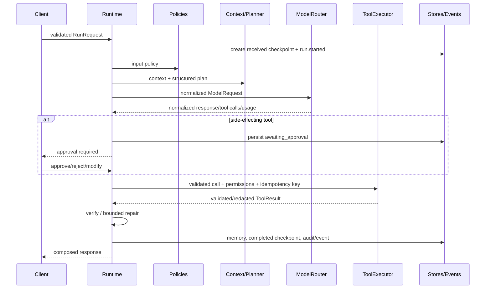

# Architecture and key decisions

## Boundaries

`types` owns normalized contracts. `runtime` owns legal transitions and termination. `planning`, `context`, `policies`, `verification`, `responses`, and `tools` are independent strategies. `models/providers`, `persistence`, and `api` are adapters. `orchestration/container.py` is the only default composition root.

Key decisions:

1. Runs use optimistic versioning. A resume or worker may update only the checkpoint version it loaded.
2. Side-effecting calls carry `run_id:tool_call_id` idempotency keys. Approval persists before execution; completed call IDs persist after execution.
3. Plans are strict models with unique IDs and backward-only dependencies. The runtime executes only registered action kinds, enabled tools, and allowed models.
4. Capability discovery happens before routing. Unhealthy, disallowed, or incapable models are excluded; the router then uses quality and observed latency.
5. Paused states are durable. Active asyncio tasks are an optimization, not the durable source of truth. A production scheduler can claim saved runs without changing orchestration.
6. Core storage defaults to isolated in-memory adapters. PostgreSQL provides durable run checkpoints; Redis provides checkpoints and expiring session memory.
7. Diagnostic logs and immutable audit contracts are separate. Both pass through redaction before export.

## Execution flow

## Configuration precedence

Built-in defaults are merged with YAML files, `AGENT_CORE__` nested environment variables, and deployment overrides. Agent and request settings are resolved by orchestration; request overrides are strict and should be allowlisted by deployments. Unknown fields fail validation.

